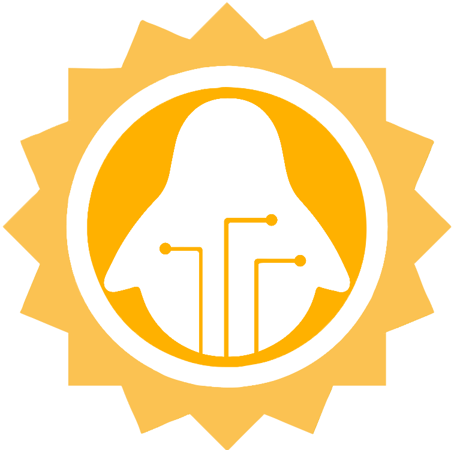

    
     
    <h1 align="center"> ASoC </h1>

Welcome to the GitHub repository for the ALiAS Summer of Code (ASoC) program! This repository serves as the central hub for all things related to ASoC, including the website, documentation, resources, and more. Here, you'll find the source code for the ASoC website, which is built using [Nextra](https://nextra.site/), a React framework for static websites.

## About ASoC

ASoC is an open-source program organized by ALiAS (Amity Linux Assistance Sapience) that aims to provide an opportunity for Amity University students to contribute to open-source projects during the summer. The program encourages collaboration, learning, and professional development among participants. By participating in ASoC, students gain valuable experience working with open-source projects, receive mentorship from experienced developers, and have the opportunity to make meaningful contributions to the open-source community.

## Getting Started

To get started with the ASoC website locally, follow these steps:

1. Clone the repository: `git clone https://github.com/asetalias/asoc.git`
2. Navigate to the project directory: `cd asoc`
3. Install the dependencies: `yarn install`
4. Start the development server: `yarn next`
5. Open your browser and visit `http://localhost:3000` to view the website.

For more information visit the [Nextra documentation](https://nextra.site/docs/).
